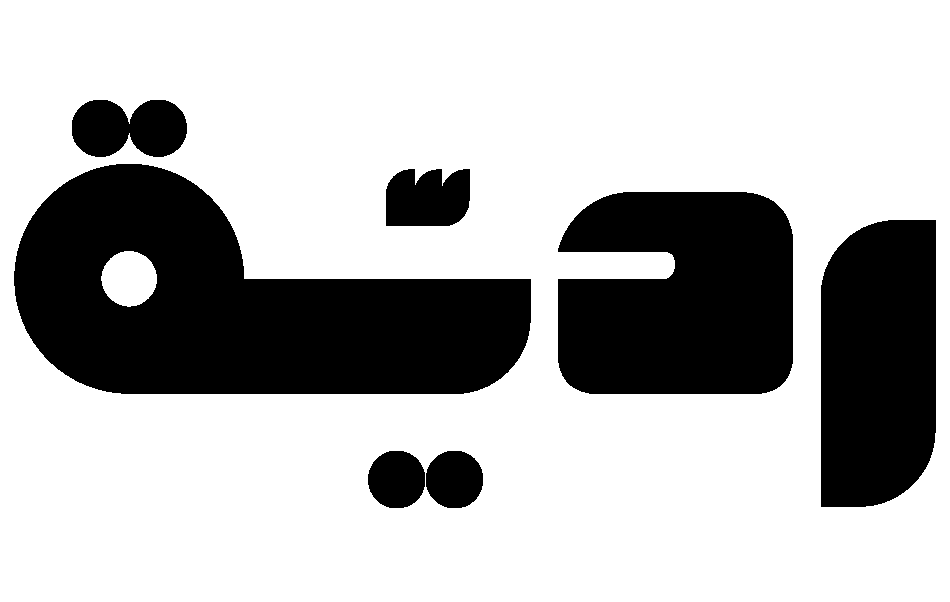

[](https://colab.research.google.com/drive/1gBHidEO7xLpo7waL7V7wkoj85seCH12g?usp=sharing)
[](https://drive.google.com/file/d/1L9WlzMrlGvpDRZr2O9cdiriUJar248EA/view)

<div align="center">
    
  

</div>


## Overview

This project features Allam a powerful genrative model devlpoed by SADAIA. we have used Transfer learning technices by refining Allam along whith secondd model called Ashaar to devlop agent that capeple to understand and generate Arabic poetry. It includes capabilities for analyzing rhyme schemes and rhythms, providing efficient real-time responses, and offers a user-friendly website for interaction.

## Features

- **Poetry Understanding**: The model can analyze and comprehend the nuances of Arabic poetry.
- **Poetry Generation**: Users can generate original Arabic poems based on input prompts.
- **Rhyme and Rhythm Analysis**: Automatically analyzes the rhyme schemes and rhythmic patterns in Arabic poetry.
- **Real-Time Responses**: Provides quick feedback and results, enhancing user experience.
- **User-Friendly Interface**: A clean and intuitive website that makes it easy for users to interact with the model.

## Installation

To run this project locally, follow these steps:

1. Clone the repository:
   ```bash
   git clone https://github.com/ManarEyad7/Redya
   cd Redya
   ```

2. Install the required dependencies:
   ```bash
   pip install -r requirements.txt
   ```

3. Run the application:
   ```bash
   python app.py
   ```

4. Access the application in your web browser at `http://localhost:5000`.

## Usage

1. **Input**: Enter a few lines of poetry in Arabic.
2. **Generation**: Redyah Generate respone of new poetry based on your input.


## License

This project is licensed under the MIT License. See the [LICENSE](LICENSE) file for details.

## Acknowledgements

- Thanks to the contributors and the community for their support.
- Special thanks to the developers and researchers at SADAIA who laid the groundwork for natural language processing in Arabic.
## References 
Alyafeai, Z., Al-Shaibani, M. S., & Ahmed, M. (2023). *Ashaar: Automatic Analysis and Generation of Arabic Poetry Using Deep Learning Approaches*. arXiv preprint arXiv:2307.06218.
Bari, M. S., †, Alnumay, Y., & National Center for AI (NCAI), Saudi Data and AI Authority (SDAIA). (2024). ALLAM: Large Language Models for Arabic and English [Journal-article]. arXiv. https://doi.org/10.2407/15390

## Contact

For any inquiries, please contact [renoalomari1100@gmail.com].

<div align="center">
    
</div>
